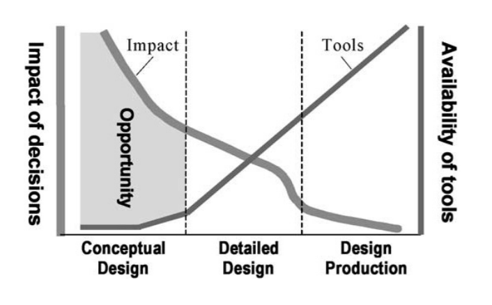

# Overview

**PreStage** is an application designed for Microsoft Hololens that facilitates mass 3D modeling and early-stage planning of architectural projects. It provides a user-friendly toolkit for creating and modifying various geometric primitives. Similar to popular modeling software such as Blender or 3dsMax, users can manipulate vertices, edges, and faces of primitives. The application's transform system is specifically tailored for an augmented reality (AR) environment, allowing users to utilize natural hand gestures and convenient voice control commands.

Additionally, PreStage includes a built-in OBJ exporter, enabling users to easily export their models in .obj format. This makes it convenient to continue working on the models in other 3D modeling software or directly send them for 3D printing.

  

## Motivation

    “Before airplanes, it took mail carriers on horseback months to transport letters across the country. Before washing machines, it took a full day of physical exercise to wash and dry a family’s laundry. And before cranes, it took decades—sometimes centuries—to build large structures such as castles and cathedrals. The point being: Whatever you do, technology probably gives you a better way to do it.” - Anonymous

The inception of an architecture project involves a fundamental examination of shape and size. Ensuring the precise alignment of these aspects is crucial, as no amount of intricate architectural detailing or facade materials can compensate for a building that lacks proportion and fails to harmonize with its surroundings.

Surprisingly, despite the advent of the Information Age, the architectural massing process has seen limited advancements, with the predominant method still involving the manual assembly of cardboard or the sculpting of styrofoam. This traditional approach not only hampers efficiency and flexibility, but also poses challenges for remote collaborative work.

In light of this, my thesis delved into researching this issue and sought potential remedies. As a result, I developed Prestage, a prototype mixed reality application aimed at addressing these challenges.

# Demo

  

## Features

  

[Main menu](https://youtu.be/_Hm1dLkd4EI?list=PLZr-Sb1KKVxNQQNdy_gAbnMdPPQqvpIft)

[Context menu](https://youtu.be/t6VtFgqqTEo?list=PLZr-Sb1KKVxNQQNdy_gAbnMdPPQqvpIft)

[Gizmo types](https://youtu.be/cUHBHRrtNxc?list=PLZr-Sb1KKVxNQQNdy_gAbnMdPPQqvpIft)

# License

This project is licensed under the MIT License. For the full text of the MIT License, please refer to the [LICENSE](/LICENSE) file in this repository.
